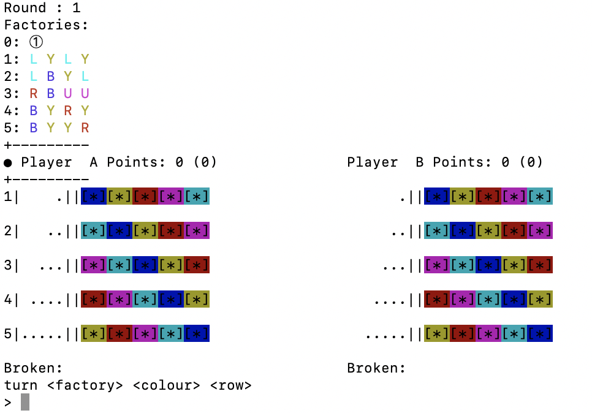
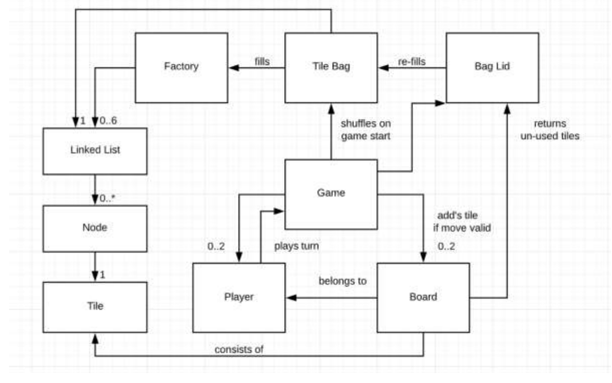

# Azul Game (Console)

Implements the Azul board game as a console game built in C++

### Playing
Just run `./azul-game -s` and the console will prompt you through
the steps to set-up names for players and the various different modes
of the game.

### Advanced Play
The game implements advanced modes:
- Choice of 2, 3 or 4 players
- Players can choose a "Grey Mode" or even a 6-tile mode
- Players can also choose to pick from one or two central factories.

     
### Architecture
The architecture of the application follows a standard Object-Oriented Architecture with the objects
divided into re-usable, single-responsibility components which follow composition over inheritance. 

### Testing
Conducted various tests by automatically saving the game 
during various points of the gameplay and restarting the game
from this saved state. The various tests are in the `tests` folder.